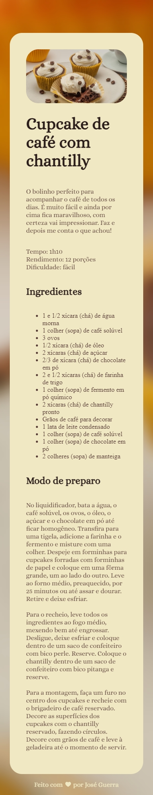
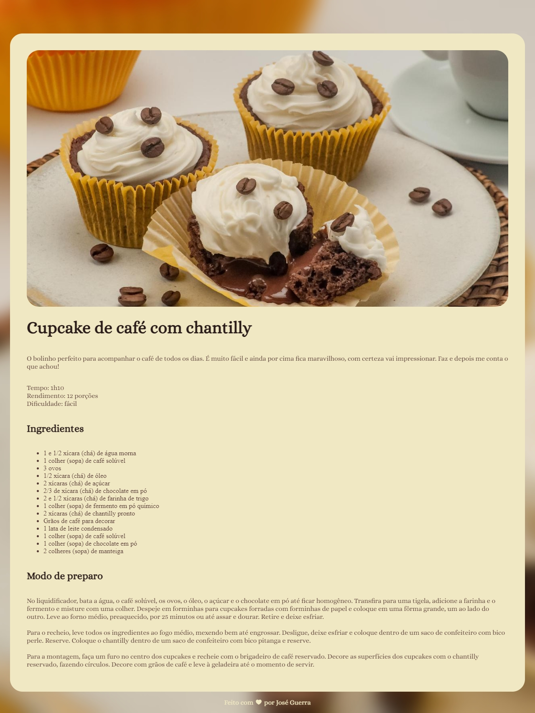

# 🍰 Cake Recipe

## 📚 What is a repository?

This repository showcases a simple web page built with HTML and CSS that presents a delicious cake recipe. The design includes sections for ingredients, step-by-step instructions, and visual enhancements for an easy and enjoyable user experience. Perfect for practicing basic front-end development skills!.

## 📫 Contact

Email: luisvitorioguerra@hotmail.com
LinkedIn: www.linkedin.com/in/josé-guerra-bb870219b